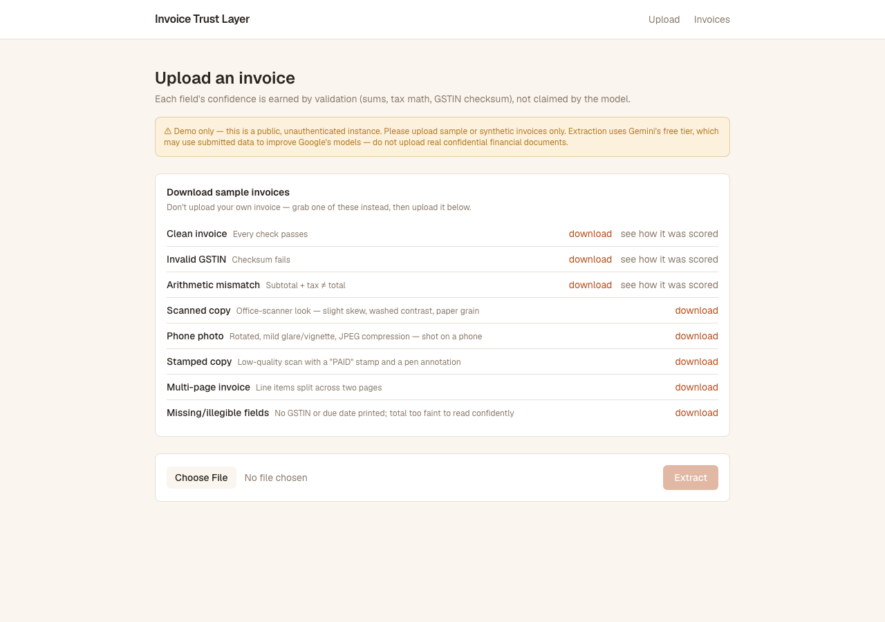

# Invoice Trust Layer

Messy invoices → structured, **trustworthy**, queryable data. Every extracted field is
confidence-scored (confidence *earned by validation*, not claimed by the model), traceable
to its source in the document, and correctable by a human.

**Live demo:** https://invoice-trust.vercel.app — don't upload a real invoice; download one
of the sample documents on the landing page instead (see below).



Zamp Engineering Project · Problem #3. See [`SCOPE.md`](SCOPE.md) for what this does and
doesn't do, and [`decisions.md`](decisions.md) for the reasoning behind every call made
getting here. [`docs/plan.md`](docs/plan.md) has the original plan.

## What it does

- Extracts vendor, GSTIN, dates, amounts, and line items from a PDF or image invoice
- Scores each field's confidence from verifiable rules (line-item sums, tax math, GSTIN
  checksum) — never from the model's own self-reported confidence
- Lets a human correct a flagged field; the whole invoice re-validates on save
- Gates "mark trusted" server-side — blocked while any flag is open, not just hidden in the UI
- Filters stored invoices by vendor, status, amount range, and date
- Shows provenance (click a field → see its source on the document) for a curated sample set
- Ships 8 downloadable sample invoices — clean, invalid GSTIN, arithmetic mismatch, scanned,
  phone photo, stamped/annotated, multi-page, missing fields — so nobody needs to upload a
  real document to try it

## Stack

Next.js 16 (App Router, TS) · Postgres (Neon) + Prisma 7 (driver adapter) · Google Gemini
(vision extraction, free tier) · Zod · Vitest + Playwright · Tailwind v4. Deploy: Vercel +
Neon, GitHub Actions (keeps the Neon compute warm — see `decisions.md` D31).

## One-shot setup

```bash
# 1. Install deps
pnpm install

# 2. Configure environment
cp .env.example .env
#    then fill in:
#    - GEMINI_API_KEY  — free, no card:  https://aistudio.google.com
#    - DATABASE_URL    — free Postgres:   https://neon.tech
#    (no file storage token needed — real uploaded documents are never persisted, see below)

# 3. Create the database schema
pnpm db:push        # push the Prisma schema to your database
pnpm db:generate    # generate the typed Prisma client

# 4. Seed the 3 provenance sample invoices (clean / invalid-GSTIN / mismatch)
pnpm db:seed

# 5. Run
pnpm dev            # http://localhost:3000
```

## Scripts

| Command             | What it does                                  |
| ------------------- | ---------------------------------------------- |
| `pnpm dev`          | Start the dev server                          |
| `pnpm build`        | Production build                              |
| `pnpm test`         | Run the test suite (Vitest)                   |
| `pnpm db:push`      | Apply the Prisma schema to the database       |
| `pnpm db:migrate`   | Create + apply a migration (dev)              |
| `pnpm db:generate`  | Regenerate the typed Prisma client            |
| `pnpm db:seed`      | Seed the 3 provenance sample invoices          |

The other 5 sample invoices (scanned/photo/stamped/multi-page/missing-fields) are static
files checked into `public/samples/`, generated by `scripts/generate-samples.ts` — that
script is build-time-only tooling, not something you need to run to use the app.

## Data handling, in short

- **Gemini's free tier may use submitted data to improve Google's models** — sample or
  synthetic invoices only, never real confidential financials (`decisions.md` D8).
- **A real user's uploaded document is never persisted, in any form.** It's processed
  in-memory for extraction and discarded once the request completes — no source-document
  retention, deliberately, given this is a public deployment with no access controls or audit
  logging. A production system would normally retain the source in encrypted object storage;
  full reasoning in `decisions.md` D21/D22, and the tradeoff is stated in `SCOPE.md`.

## Known limitations

- One document type, one template family (Indian GST tax invoices) — not tested against
  arbitrary layouts, languages, or other document types. Deliberate depth-over-breadth
  scope, not an oversight (`decisions.md` D3).
- Search is structured filters (vendor/status/amount/date), not full-text or semantic
  search over document content — cut on purpose (`decisions.md` D3/D6).
- No authentication or per-user data isolation — one shared public instance
  (`decisions.md` D18).
- Provenance (click-a-field-to-see-its-source) only works on the curated sample set, never
  on a real upload, since real uploads are never persisted (`decisions.md` D21).
- The *extracted structured fields* from real uploads are stored in plaintext, unencrypted
  — an explicitly named gap, not something silently overlooked (`decisions.md` D22).
- Neon's free-tier compute auto-suspends after idle; a keep-warm ping reduces but doesn't
  guarantee-eliminate an occasional cold-start delay (`decisions.md` D31).

## Project context

Solo submission for Zamp's Engineering Project Round (Problem #3) — not an open-source
project seeking contributions, and no license is specified.
