# Invoice Trust Layer — Architecture

This document describes the system **as it exists today**. For *why* any given piece looks
the way it does — including the false starts, reversed decisions, and things tried and
rejected — see [`decisions.md`](../decisions.md) at the repo root. That file is the
evolution; this one is the current state. Read this first if you're new to the codebase.

---

## 1. Product Overview

**The problem:** turning a messy invoice (PDF, scan, phone photo) into structured data is
commodity — any LLM does it today. The actual hard problem or a finance workflow is knowing
**how much to trust** what came out the other side. A model that hallucinates a total will
state it just as confidently as a correct one.

**What "Trust Layer" means, concretely, in this codebase:** every extracted field carries a
confidence number that is *earned*, not asserted — computed from deterministic rules
(arithmetic, a GSTIN checksum, date ordering) wherever a rule can check it, and only ever
falls back to the model's own signal (damped, capped at 70%) where nothing can verify it.
Nothing is ever presented as "certain." "Trusted" is a status a human explicitly grants, and
the server refuses to grant it while any rule-verifiable check is still failing.

**Primary user journey:** upload an invoice → the system extracts and scores it → a human
reviews flagged fields (correct a wrong value, or confirm one that's actually right) →
duplicate detection runs against every other invoice in the system, live → once nothing is
blocking, the human marks it trusted → trusted invoices are queryable and exportable.

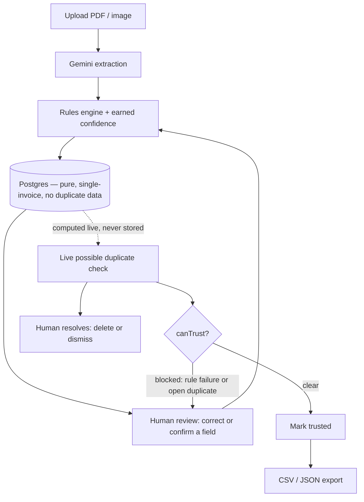

---

## 2. Technology Stack

| Layer | Choice | Why |
|---|---|---|
| Framework | Next.js 16 (App Router, TypeScript) | One deployable app for both UI and server code — no separate backend, no CORS, secrets never reach the browser (D5) |
| UI | React 19 (Server + Client Components) | Server Components do the data-fetching for pages that don't need interactivity (list, detail shell); Client Components own only the interactive slices (edit a field, confirm, delete, dismiss) |
| Styling | Tailwind v4, CSS-first `@theme` tokens | Warm/neutral design tokens, semantic color names (`danger`, `warning`, `success`) kept deliberately distinct from the decorative accent color (D26/D27) |
| ORM | Prisma 7, `@prisma/adapter-pg` driver adapter | Typed client, generated migrations; driver adapter needed for serverless-safe pooled connections on Neon (D7/D10) |
| Database | Postgres (Neon, serverless) | Relational data (invoice ↔ line items) with relational queries (range/exact filters) — no need for a second datastore (D6) |
| Extraction | Google Gemini (`@google/genai`) | Free tier, structured JSON output, returns per-field bounding boxes used for provenance (D8) |
| Validation | Zod | Typed, safe-parse boundary between "whatever the model returned" and the rest of the app (D2/`lib/schema.ts`) |
| Tests | Vitest + React Testing Library | Unit tests for pure domain logic, component tests for interactive pieces, route tests with mocked Prisma/fetch |
| Live checks | Playwright (dev-only scripts) | Accessibility and provenance-overlay-geometry checks that a DOM-string assertion can't catch (D25/D39) |

**No Server Actions.** All mutations go through explicit API Route Handlers
(`app/api/**/route.ts`) called via `fetch()` from Client Components — not `"use server"`
functions. Reads for whole pages go through async Server Components querying Prisma
directly. This is a real architectural choice, not an omission: it keeps every mutation
behind an explicit, independently-testable HTTP boundary (see §15, Security).

---

## 3. Repository Structure

```
app/
  _components/         Shared, page-agnostic components (used from more than one route)
  api/                  Route Handlers — every mutation and every cross-cutting read (export)
    health/
    invoices/
      route.ts                        POST   upload + extract
      export/route.ts                 GET    CSV/JSON export
      [id]/
        route.ts                      PATCH  correct a field · DELETE  resolve a duplicate
        file/route.ts                 GET    serve a sample invoice's PDF bytes
        trust/route.ts                POST   mark trusted (server-enforced gate)
        confirm/route.ts              POST   confirm a field without editing it
        dismiss-duplicate/route.ts    POST   resolve a possible duplicate as "not a duplicate"
  invoices/
    page.tsx             List page (Server Component) — filters, export form, duplicate badge
    [id]/
      page.tsx            Detail page (Server Component) — the orchestration root for one invoice
      DetailInteractive.tsx   Client — owns the "which field is selected" state, ties table ↔ viewer
      DocumentViewer.tsx      Client — renders the sample PDF + provenance highlight overlay
      EditableField.tsx       Client — inline correction
      ConfirmField.tsx        Client — human-confirm action
      DuplicateResolution.tsx Client — the two possible-duplicate resolution actions
      MarkTrusted.tsx         Client — the trust-gate button
  page.tsx              Home / upload page
lib/
  extract.ts            Gemini call — the only place that talks to the model
  schema.ts             Zod contract for "whatever the model returned" (D2)
  validation/
    rules.ts             Pure, deterministic business rules (arithmetic, GSTIN, dates)
    confidence.ts         Turns raw fields + rule results into per-field earned confidence
    gstin.ts              GSTIN checksum algorithm
    parse.ts               Lenient amount/date/currency/rate parsing for messy model output
  duplicate.ts           Cross-invoice matching — the ONLY place the matching rule lives
  correct.ts             Write model (correct/confirm) + the live read model (getLiveScoredInvoice)
  store.ts               Prisma writes — the only place that persists a scored invoice
  invoice-view.ts        Reshapes a stored Prisma row back into a scored-field view for display
  query.ts               URL search params ↔ typed filter ↔ Prisma `where`
  db.ts                  The single, hot-reload-safe Prisma Client instance
prisma/
  schema.prisma          The 3-table data model (§5)
  seed.ts                 Seeds the 3 curated sample invoices (D24)
tests/                    22 files, flat, one per unit — mirrors `lib/` and component names
scripts/                  Dev-only: eval harness, a11y check, provenance geometry check, sample generator
docs/                     This file, plus `plan.md`, and captured eval/a11y/provenance run results
decisions.md              The full decision log (D0–D53)
```

---

## 4. High-Level System Architecture

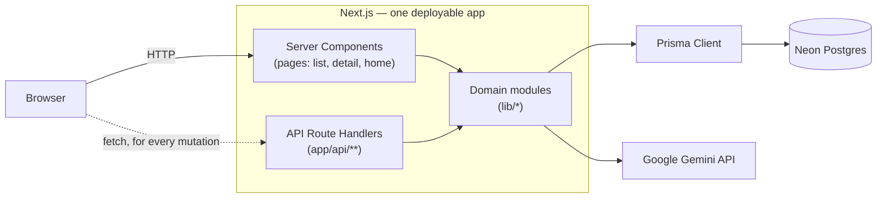

Reads for a whole page (list, detail) go straight from a Server Component through the domain
modules to Prisma — no HTTP round trip to itself. Every *mutation* (correct, confirm, mark
trusted, delete, dismiss) is a real HTTP call from a Client Component to a Route Handler,
which re-validates server-side before touching the database (§15).

---

## 5. Database Design

Three tables. No user/auth tables — this is a public, unauthenticated demo deployment by
deliberate choice (D18).

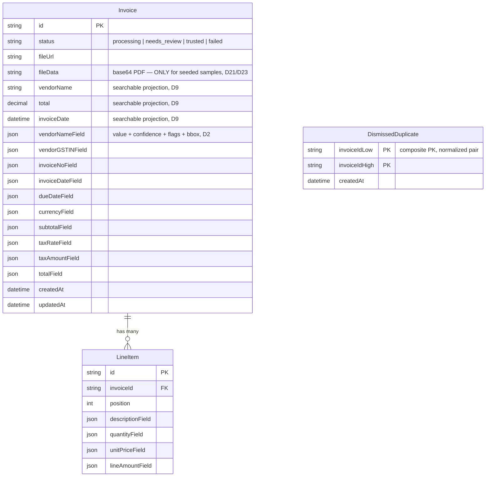

| Table | Purpose | Why it exists |
|---|---|---|
| `Invoice` | The extracted invoice, twice-represented per field: a per-field trust JSON (value + confidence + flags + bbox, D2/D9) for the trust layer, and plain typed columns (`vendorName`, `total`, `invoiceDate`) for indexed, exact-filter search (D4/D9/D16). `status` is the one human-owned lifecycle field — everything else derives from the per-field data at read time. |
| `LineItem` | One row per invoice line, same trust-JSON shape as `Invoice`'s fields. Not separately searchable (line items aren't a D4 query target) so no typed projection columns. Cascade-deletes with its invoice. |
| `DismissedDuplicate` | The **one** genuinely persisted fact about duplicate detection: a human decided two specific invoices are *not* the same document. Everything else about duplicate status is recomputed live on every read (§13) — this table exists only because a human's judgment isn't recoverable from the invoice data the way the match itself is. |

**Deliberately absent:** a persisted `canTrust`/`openFlags` column (D14 — derived on read, to
avoid a second, drift-prone copy of the truth), and any persisted duplicate-match flag
(D50–D53 — same reasoning, extended).

---

## 6. API Reference

| Endpoint | Method | Purpose | Called from |
|---|---|---|---|
| `/api/health` | GET | Liveness check | Ops / uptime tooling |
| `/api/invoices` | POST | Upload a file, extract, score (pure), persist, overlay live duplicate status on the response only | `UploadForm.tsx` |
| `/api/invoices/export` | GET | Filtered CSV/JSON export; trusted-only by default, `includeAll=true` to override | The list page's export form |
| `/api/invoices/:id` | PATCH | Correct one field; re-scores the *whole* invoice (rules are cross-field, D17) | `EditableField.tsx` |
| `/api/invoices/:id` | DELETE | Delete an invoice — server re-checks it currently has a live, unresolved possible duplicate first | `DuplicateResolution.tsx` |
| `/api/invoices/:id/file` | GET | Serve a seeded sample's PDF bytes (never a real upload, D21) | `DocumentViewer.tsx` |
| `/api/invoices/:id/trust` | POST | Mark trusted — server recomputes the gate live before allowing it | `MarkTrusted.tsx` |
| `/api/invoices/:id/confirm` | POST | Affirm a field's value without editing it (85% tier, D48) | `ConfirmField.tsx` |
| `/api/invoices/:id/dismiss-duplicate` | POST | Resolve a possible duplicate as "not a duplicate" for this specific pair | `DuplicateResolution.tsx` |

**8 route files, 9 endpoints** (one file, `[id]/route.ts`, handles both `PATCH` and `DELETE`).

---

## 7. Core Business Modules

| Module | Responsibility | Input | Output | Depends on |
|---|---|---|---|---|
| `lib/validation/rules.ts` | Deterministic, cross-field business rules — arithmetic (subtotal + tax = total, line-item sums), GSTIN checksum, currency recognition, date ordering | `RawInvoice` | `RuleResult[]` (pass/fail/na + human-readable message per rule) | `lib/validation/gstin.ts`, `parse.ts` |
| `lib/validation/confidence.ts` | Turns rule results + corrected/confirmed history into per-field earned confidence and the overall trust gate | `RawInvoice`, corrected/confirmed key sets | `ScoredInvoice` | `rules.ts` |
| `lib/duplicate.ts` | Cross-invoice matching (the only place the rule lives) + live classification + the one persisted dismissal fact | Invoice identity fields, or "compute for everyone" | `DuplicateInfo \| null`, or `Map<id, DuplicateInfo>` | Prisma (`Invoice`, `DismissedDuplicate`) |
| `lib/correct.ts` | Write model (apply a correction/confirmation, persisting a *pure* scored invoice) + the read model (`getLiveScoredInvoice`, overlaying live duplicate status, never persisting it) | field edits, or just an invoice id | `ScoredInvoice \| null` | `confidence.ts`, `duplicate.ts`, `store.ts` |
| `lib/store.ts` | The only module that writes a scored invoice to Postgres | `RawInvoice`, `ScoredInvoice` | Prisma row | Prisma |
| `lib/invoice-view.ts` | Reshapes a stored row back into `{fields, canTrust, openFlags}` for display; also the shared `computeTrust` formula | Prisma row | `InvoiceView` | — |
| `lib/extract.ts` | The one place that calls Gemini | file bytes | `RawInvoice \| error` | `@google/genai`, `schema.ts` |
| `lib/schema.ts` | Zod contract — never trust the model's raw JSON shape | `unknown` | `RawInvoice` or a typed error | Zod |
| `lib/query.ts` | URL search params → typed filter → Prisma `where` | search params | `Prisma.InvoiceWhereInput` | — |

---

## 8. Feature Flow Diagrams

### Upload & Extraction

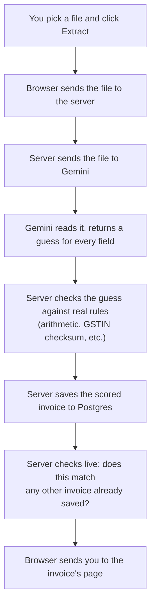

*(The live duplicate check in the last step before the redirect is never saved to the
database — only the scored invoice from the step before it is. See §13.)*

### Inline Correction

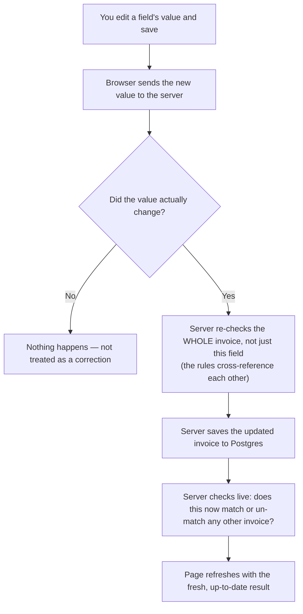

### Human Confirmation

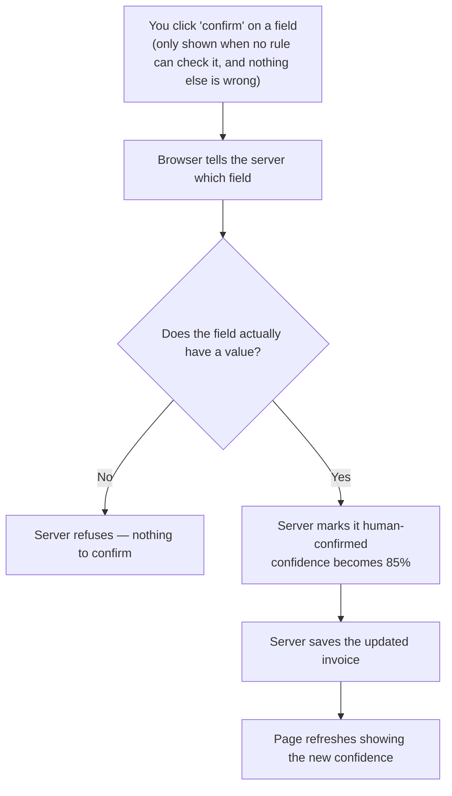

### Possible Duplicate — Live Derivation, Dismissal, Resolution

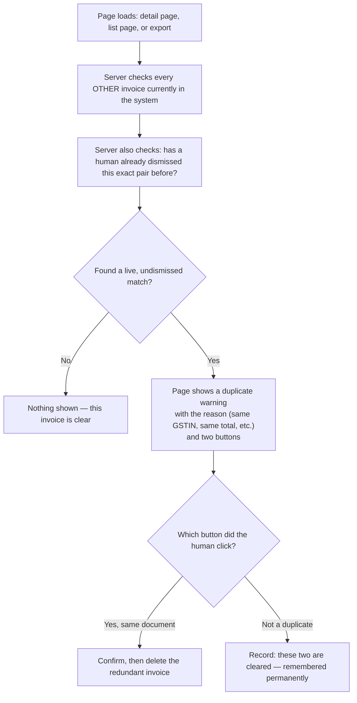

### Trust Evaluation

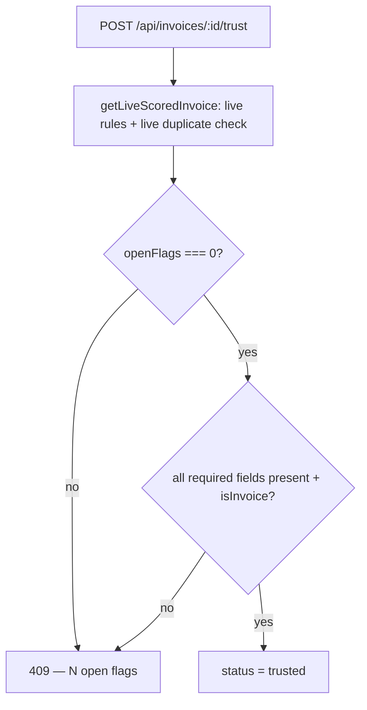

> **Known inconsistency, stated honestly:** the formula above (`scoreInvoice`'s version,
> used by the trust route, the detail page, and the list badge) differs slightly from the
> one still used by CSV/JSON export (`toView`'s version, gated on the stored `status`
> string rather than re-deriving `isInvoice`). They agree in every reachable state today,
> but they are two implementations of the same concept — a real, open item, not yet unified.

### Export

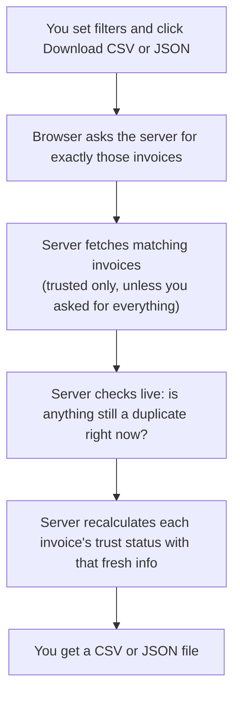

### Structured Query (list page filtering)

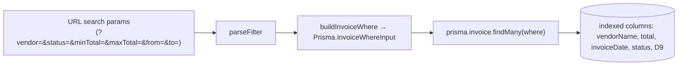

Every filter maps 1:1 to a real indexed Postgres column — no in-memory filtering, no JSON
path queries (D16).

---

## 9. Request Lifecycle — "Open an Invoice Detail Page"

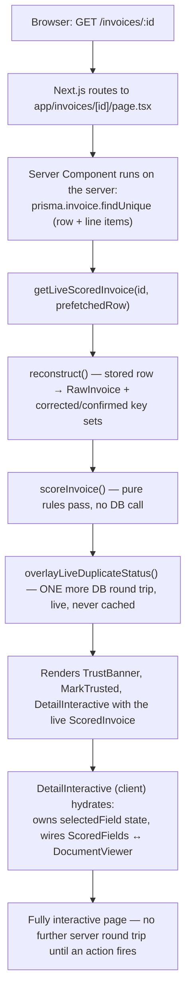

Every subsequent action (edit, confirm, mark trusted, delete, dismiss) is a distinct
`fetch()` to its own Route Handler, followed by `router.refresh()` — which re-runs this
exact same Server Component flow from step B, so the page is always showing a live re-derivation,
never a stale client-cached copy.

---

## 10. Component Architecture

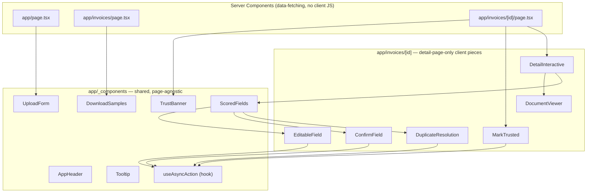

**Server/client boundary:** the three page components are Server Components — they own no
interactive state, they just fetch and render. Every component below `DetailInteractive` is
a Client Component; `DetailInteractive` itself is the one place client-side state
(`selectedField`, for the provenance click-to-highlight) lives — everything below it is
either "dumb" presentation (`ScoredFields`, `TrustBanner`, `Tooltip`) or a small, single-purpose
mutating widget (`EditableField`, `ConfirmField`, `DuplicateResolution`, `MarkTrusted`), each
built on the one shared `useAsyncAction` hook (loading/error state, extracted after it showed
up independently three times, D41).

**Reuse, honestly:** most components have exactly one call site — expected for a 3-page app.
`useAsyncAction` (5 call sites) is the one genuine cross-cutting reuse.

---

## 11. Domain Model

| Concept | What it is | Where it lives |
|---|---|---|
| **Invoice** | The extracted document. Has a lifecycle `status` (processing → needs_review/failed → trusted) that's the one thing a human explicitly sets; everything else about it is derived from its fields on every read. | `Invoice` table, `ScoredInvoice`/`InvoiceView` types |
| **ScoredField** | One field's earned state: `value`, `confidence` (0–1, never claims 100%), `verified`, `flags` (blocking), and provenance markers (`corrected`, `confirmed`, `duplicate`). | `lib/validation/confidence.ts` |
| **Possible Duplicate** | A pairing of two invoices that need a human to decide "same document" or "genuinely different." One concept, not two (D53) — computed live, never a stored fact about either invoice. | `lib/duplicate.ts` `DuplicateInfo` |
| **Trust** | A human-granted status, server-enforced: can't be set while any rule-verifiable flag is open, or while a live possible duplicate is unresolved. | `canTrust`/`openFlags`, `POST /trust` |
| **Correction** | A human explicitly changing a field's value. Re-validates the whole invoice (rules are cross-field) and, for otherwise-unverifiable fields, counts as human verification (95%). | `applyCorrection`, `corrected` marker |
| **Confirmation** | A human affirming a field's *current* value is correct, without changing it. Weaker evidence than a correction, capped lower (85%). | `applyConfirmation`, `confirmed` marker |
| **Dismissal** | A human's decision that a specific possible duplicate pair is *not* the same document. The one genuinely persisted fact in the whole duplicate-detection subsystem. | `DismissedDuplicate` table |

**Relationships:** an `Invoice` has many `ScoredField`s (one per extracted field, keyed by
name, including `lineItems.<i>.<field>` for line items). A `Possible Duplicate` relates two
`Invoice`s to each other, not to any single one. A `Dismissal` also relates two `Invoice`s —
it's the resolved, remembered counterpart to a possible duplicate that was reviewed and rejected.

---

## 12. Validation Pipeline

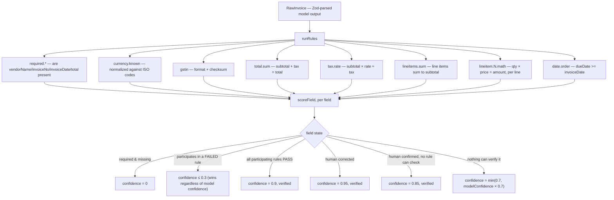

A failed rule **always** wins over a human correction or a confident model — arithmetic and
checksums can't be overridden by assertion, only fixed (D17).

---

## 13. Possible Duplicate Pipeline

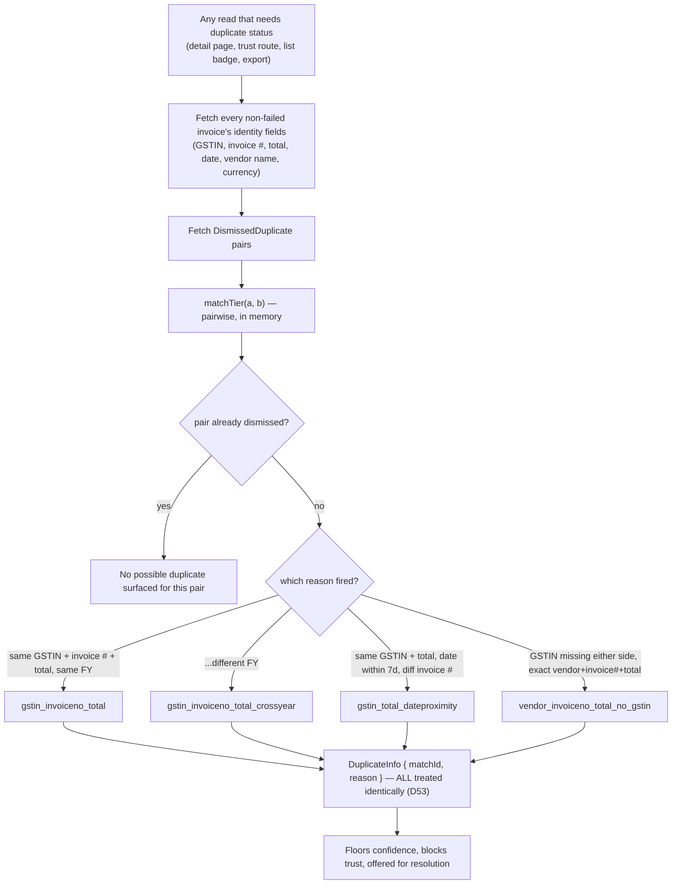

**Why this is never persisted:** a match is a fact about the *current* relationship between
two rows — recomputable at any moment from data that's already there. Storing it creates a
second, independent copy of a conclusion that can silently drift from the data it's
supposed to summarize the instant either invoice — or any *other* invoice — changes. The one
fact that genuinely can't be recomputed is a human's decision to dismiss a specific pair,
which is why exactly that, and only that, gets a table (§5).

---

## 14. Trust Evaluation — Full Rule Set

An invoice can be marked trusted only when **all** of the following hold, checked live,
server-side, at the moment of the request:

1. Every field's `flags` array is empty (`openFlags === 0`) — no failed arithmetic check, no
   failed GSTIN checksum, no missing required field.
2. All four required fields (`vendorName`, `invoiceNo`, `invoiceDate`, `total`) are present.
3. The extraction itself was classified as an invoice (`isInvoice`).
4. No live, unresolved possible duplicate exists against any other current invoice.

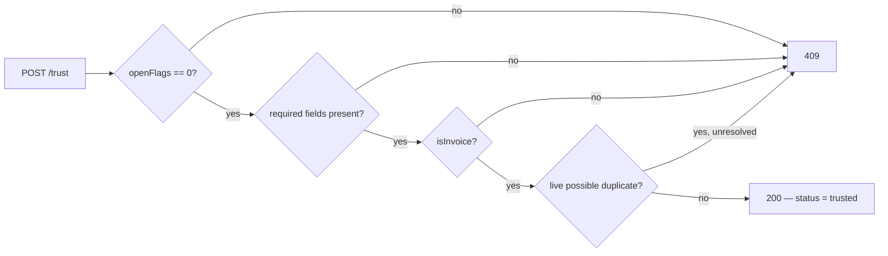

None of these four checks are hidden behind a client-side disable — the route re-derives
every one of them itself (D14), so hitting the endpoint directly can't bypass any of them.

---

## 15. Security

- **No authentication** — a deliberate, documented scope cut (D18) for a public evaluation
  demo. There is no per-user data isolation; every upload lands in one shared list.
- **Every trust-relevant decision is server-enforced, never UI-only.** The trust gate (D14),
  the delete authorization (only while a live possible duplicate exists, D49/D53), and the
  correction/confirmation validation (unknown field keys throw) are all re-checked inside the
  Route Handler itself — a client-side disabled button is never the only guard.
- **The extraction boundary never trusts the model's raw shape.** `lib/schema.ts`'s Zod
  parse is the one gate between "whatever Gemini returned" and every downstream module —
  a value that won't parse becomes a low-confidence flag, never a crash or an injected shape.
- **A real user's uploaded document is never persisted** — extracted in memory, discarded
  (D21). Only three curated sample invoices (used for the provenance demo) are stored, and
  are visibly badged "sample" everywhere they appear so they're never mistaken for a real
  submission (D24).
- **Money arithmetic uses a tolerance (`MONEY_TOL = 0.02`), not exact float equality** —
  absorbs legitimate rounding noise without being a security control; a genuinely wrong
  total still fails outside the tolerance band.

---

## 16. Performance Considerations

- **Structured query filters map 1:1 to indexed Postgres columns** (`vendorName`, `total`,
  `invoiceDate`, `status`, D9) — no in-memory filtering, no JSON-path scans.
- **Duplicate classification is O(n²) in memory, once per request** (`classifyAllDuplicates`)
  — correct and cheap at this dataset's scale (a handful to a few hundred rows); explicitly
  **not** designed to scale past that without revisiting the derive-vs-persist tradeoff (a
  materialized, trigger-maintained column would reintroduce the exact persisted-derived-state
  tension D50–D53 resolved, so it isn't a free win — see `decisions.md` D50 for that reasoning).
- **Every detail-page render and every write now re-runs the full rules engine** (via
  `getLiveScoredInvoice`/`overlayLiveDuplicateStatus`) rather than trusting a cached score —
  correct, but a real, accepted cost increase over the pre-D50 "just read the stored JSON"
  path, since only the duplicate portion actually needed to go live.
- **Export batches its live duplicate check** — one `classifyAllDuplicates()` call for the
  whole result set, not one query per exported row.
- **Provenance overlay positioning is percentage-based, not pixel-based** (D25) — tracks
  whatever size the PDF canvas actually renders at with zero resize-tracking code, for free
  from the browser's own layout engine.
- **The three independent DB reads on `/invoices`** (invoice list, trusted count, live
  duplicate classification) run under a single `Promise.all` rather than sequentially
  (D55) — removes a self-inflicted 3x multiplier on round-trip latency; it does not touch
  the cold-start cost below, which is a separate, infrastructure-level factor.

**Development deployment note.** The live demo runs on Neon's free tier, whose compute
automatically suspends after a period of inactivity. The first request after a suspension
can take an extra ~0.8–1.2s while the database resumes. This is a property of the hosting
tier, not the application's architecture — a production deployment would use an always-on
database tier (or equivalent), which removes it entirely. An earlier attempt at masking
this with a scheduled keep-warm ping (`.github/workflows/keep-warm.yml`, D31) turned out
not to fire reliably enough to matter (GitHub deprioritizes cron on low-traffic repos), and
patching that with a third-party uptime-monitor dependency was considered and deliberately
rejected: it would make the architecture depend on a workaround for a free hosting plan
rather than actually being faster, so it's stated here instead (D56).

---

## 17. Testing Strategy

**22 test files**, covering:

- **Pure domain logic** (`lib/validation/*`, `lib/duplicate.ts`, `lib/query.ts`,
  `lib/schema.ts`) — unit tests, no mocking needed beyond Prisma where a module touches the DB.
- **Route Handlers** (`*-route.test.ts`) — mocked Prisma/domain modules, asserting on status
  codes, response bodies, and exact call arguments (e.g. that the trust route asks for a
  *live* check, not a stored one).
- **Interactive components** (`ConfirmField`, `DuplicateResolution`, `EditableField`,
  `MarkTrusted`, `ScoredFields`, `UploadForm`) — React Testing Library, real user interaction
  (`userEvent`), mocked `fetch`/`next/navigation`.
- **Fixture-based scoring** (`fixture-samples.test.ts`, `fixture-score.test.ts`) — the three
  seeded sample invoices' hand-authored ground truth, verified against their intended outcome.

**Outside Vitest, dev-only scripts** (not CI-safe, run manually):
- `pnpm eval` — live Gemini calls against a fixture set (non-deterministic by nature, D37).
- `pnpm a11y` — Playwright accessibility pass (D39).
- `pnpm check:provenance` — Playwright geometry check that the highlight overlay actually
  lands where it claims to (the exact bug class D25 fixed).
- `pnpm e2e` — Playwright end-to-end (D57/D58): confirm → correct → trust, both duplicate
  resolutions, export, and search/filter, driven against the real running app. Every
  invoice it touches is created and torn down by the script itself (never the seeded demo
  samples), so it can't leave stray rows in the shared database.

**Known, partially-narrowed gap:** the three page-level Server Components
(`app/page.tsx`, `app/invoices/page.tsx`, `app/invoices/[id]/page.tsx`) still have **zero**
Vitest coverage, despite containing real orchestration logic (live duplicate overlay
wiring, batch classification). `pnpm e2e` now exercises the actual request/render path
through all three via a real browser, which is real coverage of the flows they
orchestrate — but it's a manual, dev-only script, not something CI runs, so this remains
the largest *automated, CI-enforced* testing gap in the repo.

---

## 18. ADR Index

Full reasoning, alternatives considered, and what was cut for every entry lives in
[`decisions.md`](../decisions.md). This table is a navigational index, not a replacement.

| ADR | Title |
|---|---|
| D0 | How the problem choice (#1/#2/#3) was actually arrived at, not just the pick |
| D1 | Problem #3, scoped to invoices — a trust system, not a commodity extractor |
| D2 | Confidence is earned by validation, never the model's self-report |
| D3 | One document type, behind a modular extraction seam |
| D4 | Structured query/search is baseline scope, not a stretch goal |
| D5 | Next.js as one full-stack app, over a separate frontend + backend |
| D6 | Postgres (Neon) over a vector DB or NoSQL |
| D7 | Prisma (typed ORM) over raw SQL |
| D8 | Gemini free tier for extraction, over paid Claude vision |
| D9 | Denormalize searchable values alongside the per-field trust JSON |
| D10 | Neon: pooled connection for the app, direct for migrations |
| D11 | Build order: extraction-first vertical slice, not validation-first |
| D12 | Direct URL on `config.url`, not `directUrl` (corrects D10's mechanism) |
| D13 | The earned-confidence scoring model, made concrete |
| D14 | Trust is a server-enforced human gate; derived, never stored |
| D15 | UI stays deliberately plain until the functional core is done |
| D16 | Query as URL-param filters over indexed columns, server-rendered |
| D17 | Inline correction re-validates the whole invoice; a human edit counts as verification |
| D18 | Deploy posture: public demo URL, no auth, synthetic-invoices-only disclaimer |
| D19 | Deploy mid-build, not after the whole feature set is done |
| D20 | Normalize currency symbols to ISO codes (a real-user-data finding) |
| D21 | Never persist a real user's uploaded document; provenance runs on curated samples only |
| D22 | Considered encrypting the sample invoices; decided against it (wrong threat model) |
| D23 | Store sample-invoice bytes as base64 text, not a native `Bytes` column (adapter bug) |
| D24 | Three curated samples, hand-authored ground truth, clearly badged in the UI |
| D25 | Fixed a real provenance-overlay misalignment; adopted Playwright for geometry checks |
| D26 | UI polish gets a dedicated pass; evals continue as an ongoing thread |
| D27 | UI polish: warm design tokens, Tailwind inherited, shared header |
| D28 | UI polish round two: self-critique against real screenshots |
| D29 | Downloadable sample invoices as a privacy-preserving sandbox |
| D30 | A deploy failure `tsx` silently let through — build-time vs script-runner typecheck gap |
| D31 | Perceived navigation lag: two separate causes, two separate fixes |
| D32 | Drop the home page's inline result; redirect to the detail page instead |
| D33 | Added `SCOPE.md` — the scope was locked early, it just never got its own document |
| D34 | Split `TrustBanner` out of `ScoredFields.tsx`; stated the component-folder convention |
| D35 | Explain the confidence ceiling instead of leaving 90%/95% looking unresolved |
| D36 | Added component tests (React Testing Library) on the components worth testing |
| D37 | Built and ran a real eval harness — it immediately found a real bug |
| D38 | Route-handler tests for the two claims the product actually rests on |
| D39 | Ran a real accessibility check; found and fixed two WCAG AA failures |
| D41 | Fixed the two most defensible findings from a self-audit against clean-code principles |
| D42 | Export built first; duplicate detection deferred, not rejected |
| D43 | Collapsed per-field CSV flag columns into one, after opening the actual file |
| D44 | Duplicate detection v1: two tiers, deliberately unequal severity |
| D45 | Synced `SCOPE.md`/`README.md` to reflect Export and Duplicate Detection |
| D46 | Cleaned up accumulated test data; kept one deliberate duplicate pair, not zero |
| D47 | Invoice list filters run server-side, not client-side |
| D48 | A real "confirm" tier (85%); resubmitting an unchanged value stops being a fake correction |
| D49 | A scoped delete: only while an invoice has an open duplicate flag |
| D50 | Duplicate status becomes derived state, not persisted state |
| D51 | Rebuilt the matching rule: fiscal-year bound, currency veto, no-GSTIN fallback |
| D52 | Finished the derive-not-persist migration — export and the last stored-flag consumer |
| D53 | Collapsed hard/soft duplicate tiers into one concept: a Possible Duplicate |
| D54 | Added `docs/ARCHITECTURE.md` as a standing reviewer-facing document |
| D55 | Parallelized the three independent DB reads on `/invoices` |
| D56 | Rejected a third-party uptime monitor; documented the Neon cold start instead |
| D57 | Extended Playwright for e2e scenarios instead of introducing Cypress |
| D58 | Built the Playwright e2e harness (`pnpm e2e`); it caught two real test bugs |
| D59 | Added README screenshots; fixed a real flag-disclosure discoverability gap |

*(D40 does not appear — an LCP/font-preload investigation was started, then deliberately
removed once deferred indefinitely; the log records what's real, not a renumbered sequence.)*

---

## 19. Design Principles

Principles actually visible in the implementation, not aspirational ones:

- **Confidence is earned, never asserted.** The single organizing idea of the whole codebase
  (D2/D13) — a number is only ever as high as what's actually been checked.
- **Derive, don't persist, unless persistence is measurably necessary.** Applied consistently
  to the trust gate (D14) and, after a real bug forced the question, to duplicate status
  (D50–D53). The one exception (`DismissedDuplicate`) is a human decision, not a computed fact
  — explicitly justified, not a quiet violation.
- **Server-enforced, not UI-hidden.** Every gate that matters (trust, delete, field
  validation) is re-checked inside the Route Handler, independent of what the client showed.
- **A rule failure can't be overridden by assertion, only fixed.** True for arithmetic/GSTIN
  checks (D17) and, once the domain model was pressure-tested, for possible duplicates too
  (D53) — a human resolves the underlying question, never just asserts past it.
- **Modular seams around genuinely uncertain external dependencies.** Extraction sits behind
  one clean seam (D3) specifically because the model provider was expected to be revisited
  (D8 swapped it once already, cheaply, because of that seam).
- **Small, single-purpose components over configurable ones.** `EditableField`,
  `ConfirmField`, `DuplicateResolution`, `MarkTrusted` each do exactly one mutating thing,
  sharing only the generic `useAsyncAction` hook — not one large "field actions" component.
- **The decision log is part of the architecture.** Every non-trivial call, including
  reversed ones, is recorded with its alternatives and what was cut — treated as a real
  engineering artifact, not after-the-fact narration.

---

## 20. Architecture Summary

| | |
|---|---|
| API endpoints | **9**, across 8 route files |
| Database tables | **3** (`Invoice`, `LineItem`, `DismissedDuplicate`) |
| Core domain modules (`lib/`) | **12** files across extraction, validation, duplicate detection, correction, and persistence |
| Major business flows | Upload & extraction · inline correction · human confirmation · possible duplicate detection & resolution · trust evaluation · structured query · export · provenance |
| Test files | **22**, plus 3 dev-only Playwright/eval scripts |
| Pages (Server Components) | 3 — home/upload, list, detail |
| Client components | 10, each single-purpose |
| Decision log entries | 54 (D0–D53, D40 intentionally absent) |

**Key architectural decisions that shape everything else:** confidence is computed, never
reported (D2/D13); trust is a server-enforced gate derived on read, never a stored verdict
(D14); duplicate status followed the exact same path after a real production-shaped bug
forced the question (D50–D53); and the one thing that genuinely can't be derived — a human's
decision — is the only thing this system persists about cross-invoice relationships.

A new engineer should be able to trace any feature end-to-end from this document alone; for
*why* it ended up this way instead of some other way, `decisions.md` has the full story.
